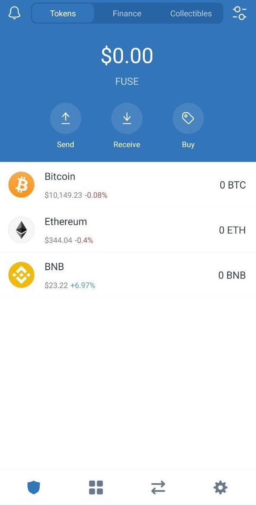
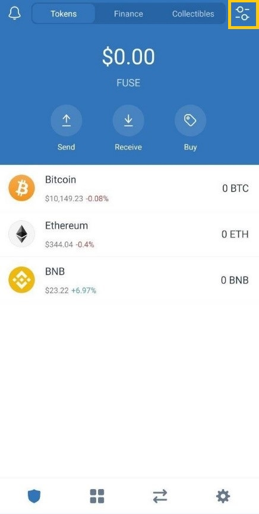
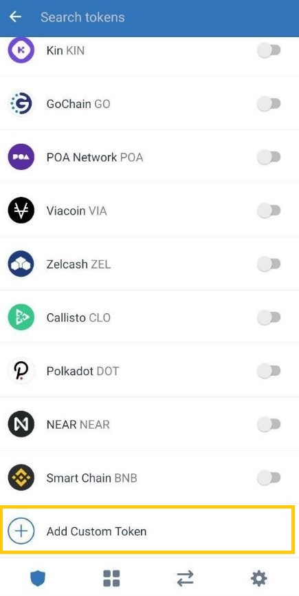
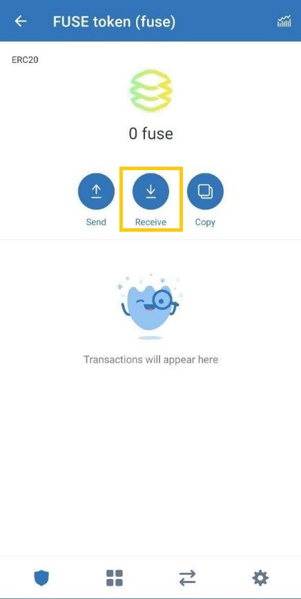
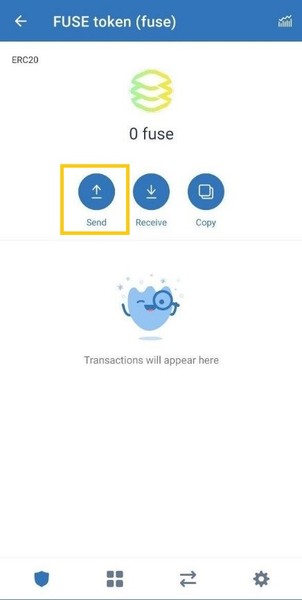
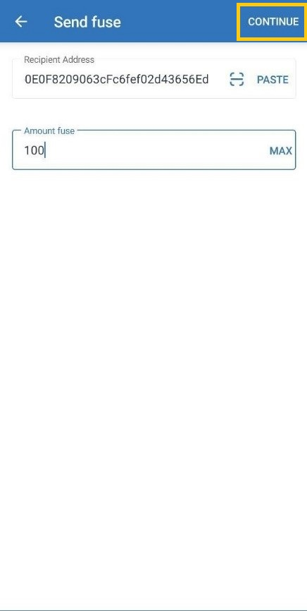

# Trust wallet tutorial

This guide has been prepared using Trust wallet version **1.15.5** on Android. 

**Step 1:** Open Trust wallet on your phone and you should see the interface as shown below. 

**Step 2:** Press the top corner button on the right hand side which will take you to the interface as shown in the below image. Scroll down to see **“Add Custom token”**.

**Step 3:** Make sure the network is selected as **“Ethereum”** and enter the BDCC contract details as mentioned below.

**BDCC**:

Contract address - **0x970b9bb2c0444f5e81e9d0efb84c8ccdcdcaf84d**

Name - **BDCC token**

Symbol - **BDCC**

Decimals - **18**

**Step 4:** You have added **BDCC** successfully on your Trust wallet and now you should see **BDCC** on your main page as shown below.

Now let’s learn how to Send/Receive **BDCC** on Trust wallet.

**To receive BDCC:** Once completing Steps 1-4, Press on **BDCC token** in the main page of your wallet and you should see the Send/Receive button as shown below. Now click on **“Receive”** and your **BDCC token** address \(Public key\) will appear to which you can send BDCC. Once the transaction is confirmed on-chain the BDCC balance will be shown.

**To send BDCC:** Press “**BDCC token”** on the main page of your wallet and you will see **“Send/Receive”** button as shown below. Now click **“Send”** which will take you to the next page where you need to enter the **“Recipient Address”** to which you want to send **BDCC** to and the **“Amount”** then click **“Continue”.** You can adjust the gas fees according to the Ethereum network gas prices and confirm the transaction.

We hope this tutorial helped you to use MEW and send/receive BDCC tokens. Until next time friends!

